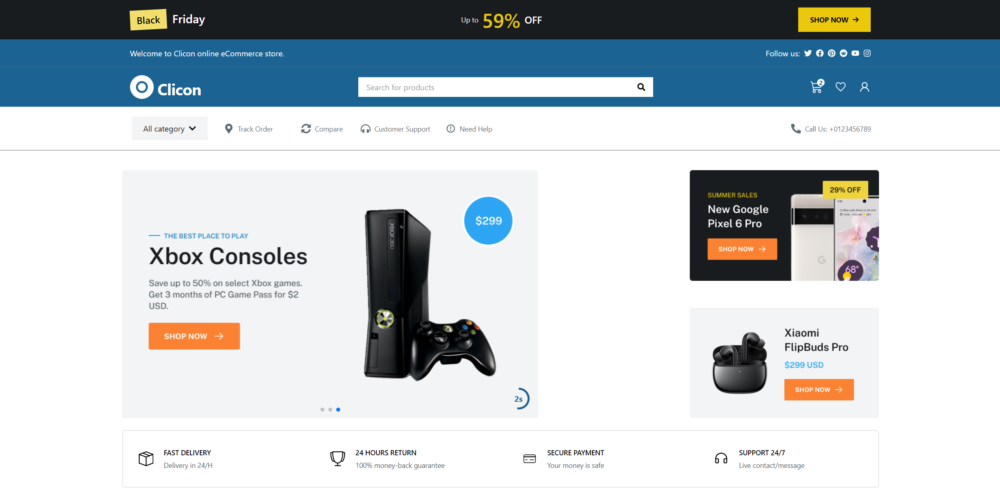
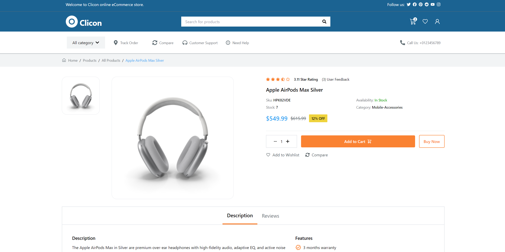
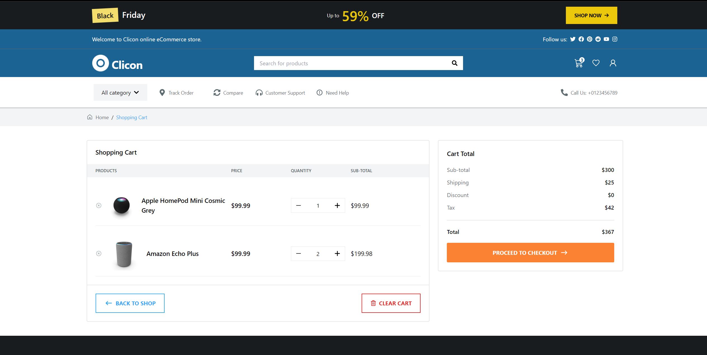

# MindSetGradProject

This repository contains **MindSetGradProject**, a modern e-commerce website designed to sell a variety of products. It offers a sleek, user-friendly interface that allows customers to browse and purchase items with ease. The project integrates dynamic product listings, advanced filtering options, and a smooth shopping cart experience, all while ensuring responsiveness across all devices.





## Features

- **Product Listings:** Browse a wide selection of products across various categories with detailed descriptions and images.
- **Dynamic Filtering:** Filter products by category, price, and more for a personalized shopping experience.
- **Shopping Cart:** Add items to your cart, manage quantities, and proceed to a seamless checkout.
- **User Authentication:** Login functionality enables customers to save their preferences and track order history.
- **Responsive Design:** Optimized for all screen sizes, from mobile phones to desktop devices, ensuring a smooth experience.

## API Integration

MindSetGradProject integrates with external APIs for dynamic product listings and user authentication, enabling secure transactions and up-to-date product information.

## Technologies Used

- **React:** A JavaScript library for building dynamic user interfaces.
- **Vite:** Provides fast and optimized development with modern build tools.
- **Tailwind CSS:** Utility-first CSS framework for building custom designs rapidly.
- **Redux:** Manages global state for cart, authentication, and product filtering.
- **React Router:** Handles routing for smooth navigation between pages.
- **Axios:** Handles API requests for product data and user authentication.
- **Local Storage:** Persists user data and cart information for a seamless shopping experience across sessions.
- **ESLint:** Ensures code consistency and quality across the project.

## Installation

To run this project locally, follow these steps:

1. **Clone the Repository:**

   ```bash
   git clone https://github.com/ahmedkamal14/MindSetGradProject.git
   cd MindSetGradProject
2. **Install Dependencies:**

   ```bash
   npm install
   
3. **Run the Development Server:**

    ```bash
    npm run dev

## API Configuration:

The application fetches data from [DummyJSON](https://dummyjson.com). No further configuration is required for development since the API is publicly accessible.

## How It Works

- **API Integration:** The app uses the DummyJSON API to fetch recipes and user data. This enables dynamic recipe search and user authentication for login functionality.
- **User Authentication:** The login functionality ensures that users can securely log in, with the app fetching their authentication data from the DummyJSON API. Once logged in, users can see personalized content.
- **Responsive Design:** The layout adapts seamlessly across devices, ensuring an optimal experience whether on a mobile phone or a desktop computer.

## Deployment

This project is deployed on GitHub Pages. You can view the live site at: [MinSetGradProject](https://ahmedkamal14.github.io/MindSetGradProject/).

## Contribution

Contributions are welcome! Feel free to fork this repository, submit issues, or create pull requests. All feedback and improvements are appreciated.
